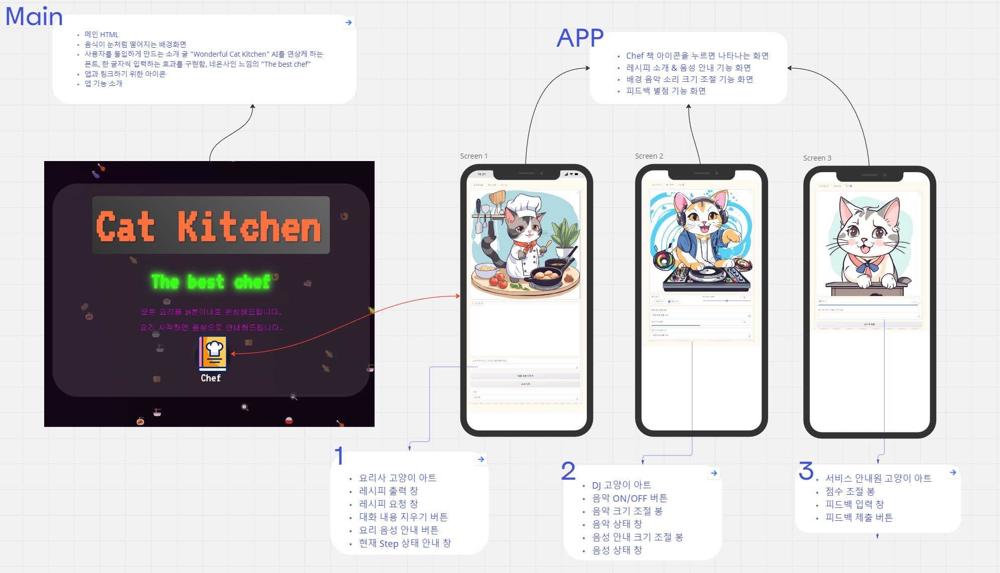

# 프로젝트 Cat Chef APP

* 모든 요리를 20분안에 만들수 있게 레시피 제공하는 APP

## 프로젝트 목표

  1. 1인 프로젝트 경험하기
  2. 프로젝트를 통해 다양한 업무용 도구를 실습하며 익히기
  3. 트러블 슈팅 대응능력 확인하기
  4. ChatGPT 4o, Claude 3.5 비교

## AI 요리 도우미 Cat Chef 앱 기획안

* 배경 및 목적
  1. 현재 상황 분석: 바쁜 현대인들은 빠르고 쉬운 요리법을 필요로 함
  2. 문제점 또는 기회: 기존 레시피 앱들은 사용자 맞춤형 안내가 부족함
  3. 프로젝트의 목적: AI와 음성 안내를 활용한 맞춤형 20분 요리 레시피 제공

* 내용
  1. 아이디어 설명: ChatGPT API를 활용한 맞춤형 20분 레시피 생성 및 음성 안내 앱
  2. 주요 기능 및 특징:
     * AI 기반 20분 레시피 생성
     * 음성 안내 기능
     * 요리 과정 실시간 안내
     * 배경 음악 재생 옵션
     * 사용자 피드백 시스템
  3. 차별화 요소: AI 생성 레시피, 실시간 음성 안내, 사용자 맞춤형 경험

* 구현 계획
  1. 필요한 리소스: Python, Gradio, ChatGPT API, SQLite, gTTS, Pygame
  2. 개발 일정:
     * 7월26-31일 APP기능 구현
     * 8월1-4일 테스트&수정
     * 8월5일 발표
  3. 주요 마일스톤:
     * UI 개선 - 고양이 이미지 추가
     * 레시피 데이터베이스 저장
     * 사용자 피드백 분석 시스템 구축 - 미완성

* 예상 효과
  1. 사용자의 요리 시간 단축, 요리 실력 향상
  2. 사용자 피드백 점수 통해 레시피 완성도 향상

* 향후 개선 방안
  1. 영양 정보 제공 기능
  2. 모바일 앱 버전 개발
  3. 제한된 재료로 최적화된 요리 제공
  4. UI 개선 애니매이션 추가

## 타임라인

## 와이어프레임

## 시연

* **Main HTML** 

* **APP**

